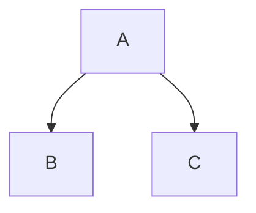

# CLAUDE.md

This file provides guidance to Claude Code (claude.ai/code) when working with code in this repository.

## Repository Overview

This is an educational documentation repository called "diagramas_resumo" (diagram summary) written in **Portuguese (pt-BR)**. It provides curated content about various diagrams used in software engineering, software design, systems architecture, and databases. The repository serves as a tutorial compilation to help students and developers understand common diagrams.

**Important**: All content in this repository is in Portuguese. When making contributions or edits, maintain Portuguese language throughout.

## Repository Structure

```
diagramas_resumo/
├── README.md          # Main documentation file (35KB+)
└── imagens/           # Images directory with 30+ diagram illustrations
    ├── artefato.png
    ├── atividades1.png
    ├── BPMN.jpg
    ├── casosdeuso*.png
    ├── classe*.png
    ├── componentes*.png
    ├── der.png
    ├── dfd3.png
    └── ... (and more)
```

## Content Architecture

The README.md is structured as a comprehensive tutorial covering:

1. **Definitions** - What diagrams are and their role in modularity
2. **DER (Entity-Relationship Diagrams)** - Entities, attributes, relationships, cardinality
3. **DFD (Data Flow Diagrams)** - Process flow representation
4. **UML (Unified Modeling Language)** - Complete coverage of 14 UML diagram types:
   - Structural diagrams: Class, Object, Profile, Component, Composite Structure, Deployment, Package
   - Behavioral diagrams: Activity, Use Case, State Machine, Sequence, Communication, Interaction Overview, Timing
5. **FMC (Fundamental Modeling Concepts)** - Brief mention (not recommended by author)
6. **Mermaid Diagrams** - How to create diagrams directly in GitHub markdown
7. **BPMN (Business Process Model and Notation)** - Business process modeling

## Image References

All images are referenced using the pattern:
```markdown

```

Or with HTML for size control:
```html

```

When adding new images:
- Place them in the `imagens/` directory
- Use descriptive filenames in Portuguese
- Reference them using the GitHub raw URL pattern above
- Consider using HTML `` tags when specific dimensions are needed

## Mermaid Diagram Integration

The repository includes examples of Mermaid diagrams embedded directly in markdown. When adding new diagrams, follow the existing pattern:

```markdown

```

## Documentation Style

The repository follows these conventions:

- **Language**: All content in Portuguese
- **Tone**: Educational and accessible for students
- **Structure**: Hierarchical with numbered sections and extensive table of contents
- **Navigation**: Each major section ends with "Voltar ao sumário" (Back to summary) link
- **Examples**: Visual-heavy with multiple diagrams and examples per concept
- **Notation Preferences**: Author provides specific recommendations (e.g., prefers attributes inside entity rectangles, not as floating ovals)

## Author's Preferences & Notes

Key observations from the content:

- **DER Notation**: Prefers attributes inside entity rectangles, NOT as floating oval balloons (explicitly states this is inefficient)
- **Logical vs Physical Views**: Distinguishes between logical and physical representations
- **FMC**: Explicitly does NOT recommend FMC notation (marked with warning)
- **Simplicity**: Encourages informal, simple diagram representations when appropriate

## License & Attribution

- **Author**: Prof. Dr. Monteiro
- **License**: CC BY-NC-SA 4.0 (Attribution-NonCommercial-ShareAlike 4.0 International)
- **Citation formats**: BibTeX and bibliographic citation included in README.md section 9

When making changes, respect the CC BY-NC-SA 4.0 license terms.

## Making Edits

When editing this repository:

1. **Maintain Portuguese language** - All text should be in pt-BR
2. **Follow existing markdown structure** - Use the same heading levels and formatting
3. **Add images to imagens/ directory** - Follow the naming conventions
4. **Update table of contents** - If adding new sections, update the "Sumário" section
5. **Add back-to-summary links** - End major sections with `[Voltar ao sumário](#sumário)<br>`
6. **Use educational tone** - Content is for students and developers learning diagrams
7. **Include visual examples** - This is a highly visual tutorial; diagrams are essential

## No Build/Test Commands

This is a documentation-only repository with no code to build, test, or run. There are no package managers, dependencies, or executables. All "development" consists of:

- Editing markdown in README.md
- Adding/updating images in imagens/
- Maintaining markdown formatting and links
