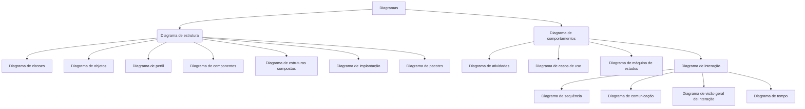
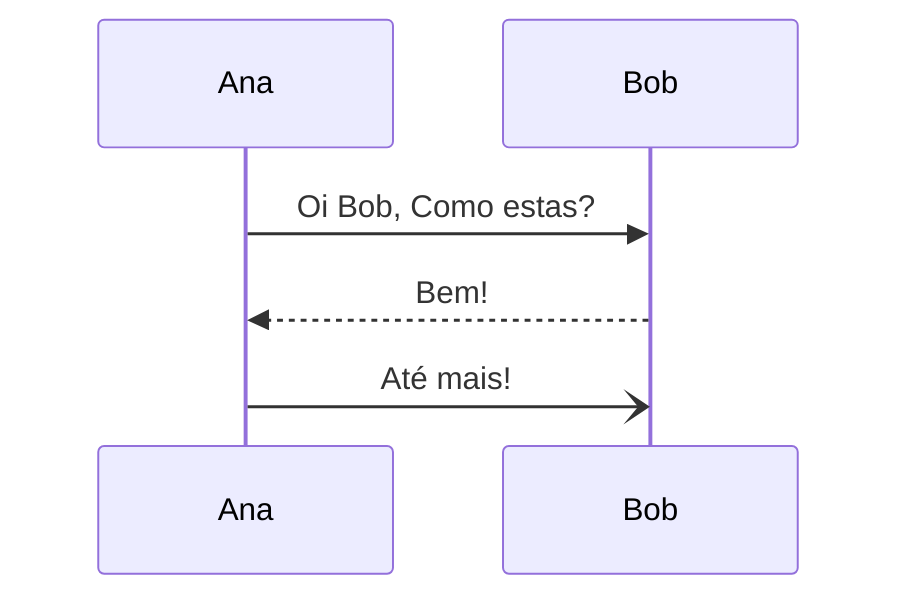
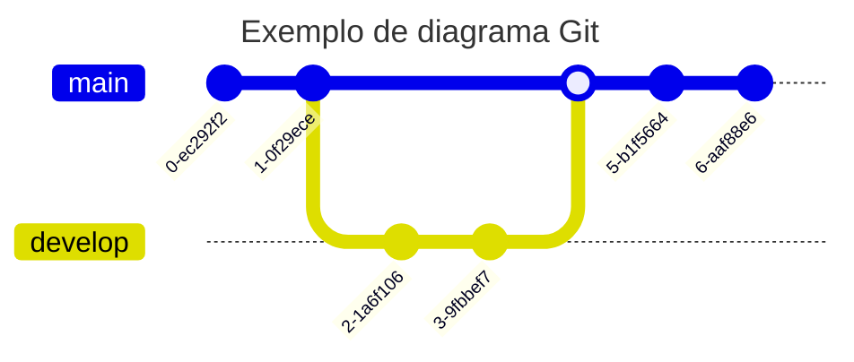
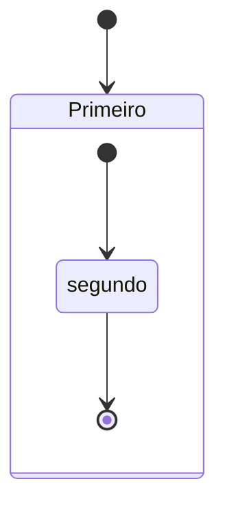
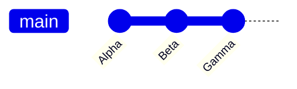

# Breve resumo de diagramas


Uma breve compilação de material (curadoria de conteúdo digital) sobre diversos diagramas utilizados na disciplina de Engenharia de Software, projeto de software, arquitetura de sistemas e bancos de dados. "Resumo dos diagramas mais comuns" que usamos nestas disciplinas. Este não é um guia definitivo, mas um pequeno tutorial compilado para auxiliar alunos e devs.


## 📚 Sobre este Material

Este repositório é um **guia prático e visual** para estudantes e profissionais que desejam compreender os principais diagramas utilizados em engenharia de software, modelagem de dados e arquitetura de sistemas.

**Ideal para:**
- 🎓 Estudantes de Ciência da Computação e Engenharia de Software
- 💻 Desenvolvedores que desejam melhorar suas habilidades de documentação
- 🏗️ Analistas de sistemas e arquitetos de software
- 📊 Profissionais que trabalham com modelagem de processos e bancos de dados

**O que você vai aprender:**
- Diagramas de Entidade-Relacionamento (DER) para modelagem de bancos de dados
- Diagramas de Fluxo de Dados (DFD) para análise de sistemas
- UML completa com 14 tipos de diagramas
- BPMN para modelagem de processos de negócio
- Como criar diagramas diretamente no GitHub usando Mermaid

```
Observação:
Este material é o mínimo necessário nas áreas de:
a) engenharia de software;
b) documentação de software;
c) arquitetura de software e sistemas;
d) modelagem visual de software.
Este material esta em construção.
```

## 🔍 Qual Diagrama Usar?

Tabela de referência rápida para escolher o diagrama adequado para cada situação:

| Objetivo | Diagrama Recomendado | Quando Usar | Complexidade |
|:---------|:--------------------|:------------|:------------:|
| Modelar estrutura de banco de dados | **DER** | Projeto de BD relacional, normalização | ⭐⭐ |
| Mostrar fluxo de processos e dados | **DFD** | Análise de sistemas, documentação de processos | ⭐⭐ |
| Documentar classes e relacionamentos OO | **Diagrama de Classes** | Design orientado a objetos, APIs | ⭐⭐⭐ |
| Capturar requisitos funcionais | **Casos de Uso** | Levantamento de requisitos, visão do usuário | ⭐ |
| Modelar fluxo de trabalho/algoritmo | **Diagrama de Atividades** | Lógica de processos, workflows | ⭐⭐ |
| Mostrar interações temporais | **Diagrama de Sequência** | Debugging, design detalhado de interações | ⭐⭐⭐ |
| Documentar arquitetura de módulos | **Diagrama de Componentes** | Arquitetura de software, organização de módulos | ⭐⭐⭐ |
| Organizar namespace/pacotes | **Diagrama de Pacotes** | Estrutura de grandes projetos, dependências | ⭐⭐ |
| Planejar infraestrutura física | **Diagrama de Implantação** | DevOps, arquitetura de deployment | ⭐⭐⭐ |
| Modelar processos de negócio | **BPMN** | Processos empresariais, automação | ⭐⭐⭐ |

**Legenda de Complexidade:** ⭐ Simples | ⭐⭐ Moderado | ⭐⭐⭐ Avançado


---
# 📑 Sumário

- [📚 Sobre este Material](#-sobre-este-material)
- [📖 1. Definições](#1-definições)
- [🗄️ 2. DER - Diagrama Entidade Relacionamento](#2-der)
  - [2.1. Entidade](#21-entidade)
  - [2.2. Atributos](#22-atributos)
  - [2.3. Relacionamentos](#23-relacionamentos)
- [🔄 3. DFD - Diagrama de Fluxo de Dados](#3-dfd)
- [🎨 4. UML - Unified Modeling Language](#4-uml)
  - [4.1. Diagrama de Classes](#41-diagrama-de-classes)
  - [4.2. Diagrama de Casos de Uso](#42-diagrama-de-casos-de-uso)
  - [4.3. Diagrama de Atividades](#43-diagrama-de-atividades)
  - [4.4. Diagrama de Sequência](#44-diagrama-de-sequência)
  - [4.5. Diagrama de Componentes](#45-diagrama-de-componentes)
    - [4.5.1. Interfaces](#451-interfaces)
    - [4.5.2. Artefatos](#452-artefatos)
  - [4.6. Diagrama de Pacotes](#46-diagrama-de-pacotes)
  - [4.7. Diagrama de Implantação](#47-diagrama-de-implantação)
- [⚙️ 5. Fundamental Modeling Concepts (FMC)](#5-fundamental-modeling-concepts-fmc)
- [✏️ 6. Criando Diagramas no GitHub](#6-criando-diagramas-em-páginas-do-github)
- [📊 7. BPMN - Business Process Model and Notation](#7-bpmn)
- [❓ 8. Perguntas Frequentes (FAQ)](#-8-perguntas-frequentes-faq)
- [📚 9. Referências](#-9-referências)
- [📝 10. Como Citar esta Página](#-10-como-citar-esta-página-em-seus-trabalhos-artigos-ou-outras-referências)
  - [10.1. Citação Bibliográfica](#101-citação-bibliográfica)
  - [10.2. Citação BibTeX para LaTeX](#102-citação-bibtex-para-latex)
- [🛠️ 11. Lista de Ferramentas](#-11-lista-de-ferramentas)
- [💬 12. Comentários Finais](#-12-comentários-finais)
- [⚖️ 13. Avisos, Licença, Estatísticas](#-13-avisos-licença-estatísticas)
  - [13.1. Avisos](#131-avisos)
  - [13.2. Licença](#132-licença)
  - [13.3. Como Contribuir](#133-como-contribuir)
  - [13.4. Créditos e Autoria](#134-créditos-e-autoria)
  - [13.5. Estatísticas](#135-estatísticas-do-repositório)


<!---

     comentario 0
     

```
exemplo de caixa de texto
```
-->


---
# 📖 1. Definições

Um diagrama é um desenho mostrando uma estrutura ou representação esquemática de algo (como uma máquina ou sistema), de forma a apresentar simplificadamente sua estrutura e/ou funcionamento. <br>

Definição 1: *Diagrama é uma representação gráfica usada para demonstrar um esquema simplificado ou um resumo sobre um assunto*.<br>
Fonte: https://www.significados.com.br/diagrama/

Definição 2: *O diagrama é um gráfico que apresenta informação de forma esquematizada e relacionada a algum tipo de área, seja na política ou economia de algum país ou empresa, e que aparece representada numericamente e em forma de tabela*.<br>
Fonte: https://conceitos.com/diagrama/

Definição 3: *Delineação; modo de representação feito através de gráficos, de esquemas, de linhas, de pontos: diagrama elétrico. Esboço; demonstração dos aspectos gerais de alguma coisa: diagrama do televisor. Tipo de maquete que contém o cenário usado nas filmagens*. <br>
Fonte: https://www.dicio.com.br/diagrama/


O diagramas aqui apresentados permitem que os sistemas possam ser estruturados de forma modular. A modularidade pode ser entendidade como:

* É a separação dos elementos constitutivos de um corpo.
* É a desagregação de seus componentes e estruturas menores.
* É a transformação do sistema em pequenas partes de forma que possam ser tratadas separadamente, porém continuam tendo suas funcionalidades mantidas para que o conjunto possa operar.
* Permite que o sistema ou software possa ser divido em partes distintas.


Onde se aplica a modelagem visual:


[Voltar ao sumário](#-sumário)<br>


---
# 🗄️ 2. DER - Diagrama Entidade Relacionamento

> **📌 Resumo Rápido**
> - **Criador**: Peter Pin-Shan Chen (1976)
> - **Uso Principal**: Modelagem de bancos de dados relacionais
> - **Componentes**: Entidades, Atributos, Relacionamentos
> - **Quando Usar**: Projeto de banco de dados, normalização, modelagem de regras de negócio
> - **Notação Recomendada**: Notação "pé de corvo" (crow's foot) para cardinalidade

O Diagrama de Entidade Relacionamento (DER), é um tipo de diagrama que apresenta as entidades de um sistema; estas entidades são conectadas por relacionamentos, as entidades possuem internamente atributos. Este diagrama é utilizado para modelar bancos de dados, também pode representar regras de negócio utilizadas pelas empresas. Também permite perceber as conexões lógicas entre "as coisas" com as quais se deseja representar informações. O criado deste diagrama é o Professor Peter Chen ([Peter Pin-Shan Chen](https://en.wikipedia.org/wiki/Peter_Chen)) na década de 1970 naSloan School of Management no MIT publicado em "*The Entity-Relationship Model: Toward a Unified View of Data*". O trabalho de DER contribuiu para o modelo de Classes e posteriormente com a UML. <br>

São componentes de um DER: entidades, atributos e relacionamentos. Os diagramas entidade relacionamento também proporcionam um meio de comunicação. Os diagramas entidades relacionamento são também chamados de diagram ER, Modelo ER. São diagramas estruturais utilizados principalmente para o projeto de um banco de dados (relacional e/ou objeto relacional). <br>


Na figura abaixo temos 3 exemplos, esta figura esta dividida ao meio, prefira as notações da direita.<br>


[Voltar ao sumário](#-sumário)<br>


## 2.1. Entidade


As entidades são "**as coisas**" que queremos representar e guardar informações sobre. São exemplos de entidades carros, objetos, lugares, pessoas, veículos, etc. As entidades são representadas por um retângulo com seu nome no centro. Na figura abaixo temos várias formas de notação diferentes para representar uma entidade.<br>


[Voltar ao sumário](#-sumário)<br>


## 2.2. Atributos

Os atributos dão características às entidades. São os elementos básicos que ajudam a formar e dar identidade às entidades. São os tijolos básicos das entidades e sua compreensão. Atributos também podem ser características de relações. <br>


> ⚠️ **Atenção - Evite Atributos como Balões!**
>
> Algumas ferramentas de diagramação representam atributos conectados nas entidades em forma oval (balões flutuantes). Esta é uma das **piores formas** de representação de atributos em entidades, pois:
> - Os diagramas ficam visualmente poluídos e difíceis de ler
> - Ocupam muito espaço conforme o modelo cresce
> - Dificultam manutenção e evolução do diagrama
> - Essa abordagem não escala bem para projetos reais

> ✅ **Boa Prática - Atributos Dentro da Entidade**
>
> Recomendamos **fortemente** representar os atributos dentro do retângulo das entidades, separando apenas o título da entidade dos atributos por uma linha horizontal. Esta notação é mais limpa, escalável e profissional. Abaixo temos uma representação na figura da esquerda a visão lógica e na da direita a visão física, representam a mesma entidade com duas visões diferentes; este mesmo exemplo pode ser utilizado nas situações de modelagem de  classe (visão lógica e física).<br>


[Voltar ao sumário](#-sumário)<br>


## 2.3. Relacionamentos

A forma como uma entidade se conecta com outra, ou seja, a forma como uma entidade (ou objeto ou "**coisa**") esta associada com outras deve ser representada por uma ligação. Esta ligação é chamada de relacionamento. Basicamente uma relação pode ser representada por uma linha simples, interligando as entidades. <br>

Nota: As entidades devem ter atributos semelhantes (e com tipos de dados semelhantes) para que esta ligação possa ser realizada. Sugerimos leituras sobre as chaves estrangeiras (FK).<br>

> 💡 **Dica - Notação de Relacionamentos**
>
> Existem diversas formas de notação para relacionamentos. Uma delas utiliza um **diamante** no centro da linha que interliga as entidades. Não recomendamos essa abordagem pois, assim como os balões de atributos, acaba ocupando uma quantidade grande de espaço conforme o modelo vai sendo especializado e ampliado.
>
> **Prefira a notação "pé de corvo" (crow's foot)** - é mais compacta e amplamente reconhecida na indústria.

Na figura abaixo o relacionamento pode ser lido como: 1(um) aluno "**pode ter**" zero ou muitos "**pets**" ou 1 (um) aluno tem nenhum ou mais de um pets. O lado "**nenhum**" (entidade na direita) pode ser visto como circulo vazio, também nesse lado direito as 3 linhas também podem ser chamadas de "**pé de corvo**". Pois um aluno pode ter mais de um pets assim como podem haver alunos com nenhum pets.<br>


Na figura abaixo temos vários exemplos de relacionamentos e suas notações com a respectiva cardinalidade (quantidade de ocorrências das entidades em cada lado).<br>


<br>

Que tal desenha o mais informal possível ? Objetivando apenas representar as entidades e suas relações.<br>


[Voltar ao sumário](#-sumário)<br>


---
# 🔄 3. DFD - Diagrama de Fluxo de Dados

> **📌 Resumo Rápido**
> - **Criadores**: Edward Yourdon, Larry Constantine, Tom DeMarco, Chris Gane, Trish Sarson
> - **Época**: Década de 1970
> - **Uso Principal**: Análise de sistemas, fluxo de dados entre processos
> - **Componentes**: Processos (círculos), Entidades Externas (retângulos), Armazenamento de Dados, Fluxos (setas)
> - **Quando Usar**: Documentação de sistemas, análise estruturada, compreensão de fluxo de informações

O Diagrama de Fluxo de Dados (DFD) é uma forma de representação das principais funções de um sistema e movimentação de dados entre estas funções, saíde de entidades e arquivos (ou bancos de dados). O DFD foi desenvolvido e popularizado na década de 70, onde ainda era comum a utilização de arquivos para o armazenamento de dados. Os principais desenvolvedores e promotores deste tipo de diagrama são: Edward Yourdon, Larry Constantine, Tom DeMarco, Chris Gane and Trish Sarson.


Os símbolos utilizados pelo DFD são simples e poucos, sendo eles:

| Símbolo | Descrição | Uso |
|:-------:|:----------|:----|
| ⭕ Círculo | Processo ou função | Representa uma transformação de dados |
| ▭ Retângulo | Entidade externa | Origem ou destino de dados (usuários, sistemas externos) |
| ▬ Retângulo lateral aberta | Arquivo de dados ou BD | Armazenamento permanente de informações |
| → Seta | Fluxo de dados | Movimento de informação entre componentes |
| ⬚ Retângulo pontilhado | Fronteira do sistema | Define os limites do sistema (opcional) |

<br>


[Voltar ao sumário](#-sumário)<br>


---
# 🎨 4. UML - Unified Modeling Language

> **📌 Resumo Rápido**
> - **Organização**: Object Management Group (OMG)
> - **Época**: Década de 1990
> - **Foco Principal**: Sistemas orientados a objetos
> - **Total de Diagramas**: 14 tipos (7 estruturais + 7 comportamentais)
> - **Diagramas Mais Usados**: Classes, Casos de Uso, Sequência, Atividades
> - **Quando Usar**: Modelagem OO, documentação de arquitetura, design de software

Unified Modeling Language (UML, ou linguagem de modelagem unificada), é um componente da engenharia de software como ferramenta de diagramação e modelagem de sistemas principalmente orientados a objetos. Outros tipos de sistemas como estruturados, real-time também podem ser modelados com UML (apesar de este não ser seu foco principal). A UML é divida em vários diagramas que abordam aspectos dinâmicos e estáricos da visão estrutural de um sistema.  A UML surgiu  na década de 1990 pelo Object Management Group (OMG).


Todos os diagramas da UML são:<br>

A-Diagramas de estrutura (aspecto estático):<br>
* 1-Diagrama de classes<br>
* 2-Diagrama de objetos<br>
* 3-Diagrama de perfil<br>
* 4-Diagrama de componentes<br>
* 5-Diagrama de estruturas compostas<br>
* 6-Diagrama de implantação<br>
* 7-Diagrama de pacotes<br>

B-Diagramas de comportamentos (aspecto dinâmico):<br>
* 8-Diagrama de atividades<br>
* 9-Diagrama de casos de uso<br>
* 10-Diagrama de máquina de estados<br>
* 11-Diagrama de sequência<br>
* 12-Diagrama de comunicação<br>
* 13-Diagrama de visão geral de interação<br>
* 14-Diagrama de tempo<br>


Tipos de diagramas da UML:



[Voltar ao sumário](#-sumário)<br>


**Os mais interessantes e populares são os citados a seguir:**

## 4.1. Diagrama de Classes

O diagrama de classe são o pilar da UML e dos projetos OO. A classe é um retângulo dividido em 3 partes (nome da classe, atributos(características ou campos) e métodos (procedimentos ou funções)). O diagrama de classes e subclasses são associadas via uma relação (similar ao DER (diagrama entidade relacionemnto)) permitindo apresentar os componentes estáticos de um sistema, esquematizando estruturas de dados poderão ser implementadas na forma de tabelas em um banco e como funções de aplicações.

Exemplos:


Outro diagrama:


Note que na figura temos uma associação (ou relação) do tipo generalização (e especialização), representada por um triangulo no início da linha. O conceito de hereditariedade é também representado por este símbolo uma linha com uma seta:


Alguns símbolos de acesso mais populares (ou modificadores de acesso ou visibilidade):

| Símbolo | Modificador | Escopo de Acesso | Quando Usar |
|:-------:|:------------|:-----------------|:------------|
| **+** | Público | Qualquer classe pode acessar | APIs públicas, interfaces |
| **-** | Privado | Apenas a própria classe | Detalhes internos de implementação |
| **#** | Protegido | Classe e subclasses | Compartilhar com herança |

**Definições detalhadas:**
* **Public (+)**: qualquer um pode acessar variáveis de instância públicas.
* **Protected (#)**: apenas métodos do mesmo pacote ou subclasse podem acessar variáveis de instância protegidas.
* **Private (-)**: apenas métodos da mesma classe (excluindo métodos de uma subclasse) podem acessar variáveis de instâncias privadas. 

Fonte: https://blog.grancursosonline.com.br/java-modificadores-de-acesso-parte-ii-15-questoes-comentadas/#:~:text=public%3A%20qualquer%20um%20pode%20acessar,acessar%20vari%C3%A1veis%20de%20inst%C3%A2ncias%20privadas%E2%80%9D.

Como exemplificado na figura abaixo:<br>


[Voltar ao sumário](#-sumário)<br>


## 4.2. Diagrama de Casos de Uso

Este diagrama da UML apresente um aspecto dinâmico de um sistema, ou melhor o comportamento do sistema com relação seus atores (sejam eles pessoas ou interações com outros sistemas). Ele apresenta partes funcionais de um sistema. Este diagrama contém atores, ações (ou funções) e fronteiras do sistema modelado. Todo ator é representado por um boneco de linhas simples ou "palitinhos". Este diagrama é foca no comportamento do sistema. Este diagrama não apresenta detalhes internos de funcionamento do sistema. 

O diagrama de casos de uso apresenta relações entre atores, funcionalidades, sistema e subsistemas, independente da ordem em que estas interações ocorrem. O diagrama permite capturar o contexto e os requisitos do sistema. 

Segue um exemplo com as estruturas abaixo:


Outro exemplo:


Para extender os casos de uso temos duas notações, incluve e extend. No tipo include o caso de uso existe uma adição de uma nova operação no caso de uso base, ou seja no caso include uma nova sub operação é adicionada. Já no caso de extend, uma funcionalidade opcional é adicionado às operações do sistema, ou seja, não é algo obrigatório.


[Voltar ao sumário](#-sumário)<br>


## 4.3. Diagrama de Atividades

São diagramas que representam o estado dinâmico de um sistema, ou seja, representam ações que o sistemas e suas partes executam. Foi incorporado à UML, é também chamado de fluxograma ou flow chart. Este diagrama apresenta atividades em retângulos com cantos arredondados, cada retângulo é uma passo do fluxo. O início de cada fluxo de atividades é representado por um bola preenchida e o fim do fluxo representado por um círculo. Geralmente o diagrama é lido na vertical, sendo o início e o final esta na base do desenho. Este desenho um símbolo de diamante para representar uma decisão ou bifurcação no fluxo indicando uma opção de caminho alternativo. Este diagrama também possibilida que atividades paralelas sejam representadas. Permite que fluxo de processos de negócio sejam identificados. Permite a modelagem de fluxos entre os casos de uso. Atividades complexas podem ser modeladas.


Uma das vantagens desse diagrama é que ele é bem popular além da engenharia de software e dos círculos de análise de sistemas, o fluxograma é um conceito bem difundido, podendo ser usando para representar a lógica de um algoritmo até os passos de uma tarefa administrativa. Pode ser usado por programadores para representar o que ocorre dentro de um caso de uso. Portanto após um caso de uso estar pronto é possível inicial o desenho do diagrama de atividades para documetno métodos, funções ou outras operações do sistema (independente se estas forem manuais ou automatizadas).

[Voltar ao sumário](#-sumário)<br>


## 4.4. Diagrama de Sequência

São diagramas que apresentam aspectos dinâmicos de um sistema orientados a eventos. Estes diagramas mostram a ordem na qual as colaborações entre as partes ocorrem. É utilizado um eixo vertical para representar uma **timeline** (linha do tempo) enquanto as mensagens são passadas entre objetos. Podem representar as interações do que foi documentado nos diagramas de casos de uso. Podem mostrar interações entre usuários e partes do sistema e partes do sistema entre si. 

Permite que sejam modeladas as colaborações entre instânicas de objetos (que **realiza** um caso de uso). Os objetos são organizados lado a lado e as mensagens que estes trocam entre si são apresentadas abaixo destes em uma ordem do topo para baixo, de direita para esquerda. A mensagem mais acima é a mais antiga e a mais a baixo são as mais atuais. A linha do tempo corre na vertical a partir de cada objeto. A linha do tempo de cada objeto representam também seu **linhas de vida** (ou life line), ou sejam, o momento que o objeto é chamado, faz sua operação e dá um retorno ou aciona outro objeto. As life line são verticais. As linhas entre as linhas de tempo ou linhas de vida são conectadas via mensagens, as mensagens são as linhas horizontais.


[Voltar ao sumário](#-sumário)<br>


Diagrama de sequência inserido no github usando a biblioteca mermaid:




## 4.5. Diagrama de Componentes

O diagrama de componenes é um "desenho" importante no projeto de um software pois apresenta os "órgãos" (ou estruturas) internas do software. Este diagrama apresenta a forma como estão conectados os elementos do software. Um componente pode representar um agrupamento de classes ou uma classe entre sistemas ou subsistemas desde que estes tenham alguma interação entre si. São identificadores apenas componentes necessários para que o sistema funcione. 

Permite representar partes de códigos fontes, pois permite representar as partes funcionais de interesse. Permite representar as peças distribuíveis e/ou substituíveis de um sistema, bem como os pontos de interface do sistema que se deseja representar e seu contato com outros sistemas. É possível representar e agrupar cada função do sistema.

Os elementos representados podem ser vários como:
* biblitecas de funções (ou outros tipos de bibliotecas)
* arquivos de documentação
* executáveis
* arquivos ou tabelas
* formulários (ou telas de usuários)
* relatórios (projeto ou templates de relatórios)
* entre outros elementos que se deseja representar sobre as partes de um sistema e seu interelacionamento.


```
Nota: A UML usa o termo componente para indicar um módulo (de classes) 
que representa um sistema (ou suas sub partes).
```

A partir de diagramas como o diagrama de classes e o diagrama de casos de uso é possível ter conhecimento de vários elementos de um sistema, a representação destes via artefatos de software vem a ter sequência com o diagrama de componentes. Estes elementos podem ser representados da 3 formas:
* Elementos de instalação: o que é necessário para rodar o software como um servidor de banco de dados, bibliotecas .net, etc
* Elementos para o funcionamento: bibliotecas matemáticas, visual c++ redistributable, bibliotecas dinâmicas DLL, arquivos de ajuda, etc.
* Elementos de execução: executáveis e seus arquivos acessórios.

O diagrama de componentes pode ser representado de várias formas, seguem alguns exemplos:


Outro exemplo, mostrando um pacote e seus componentes internos (outros pacotes), é uma forma de representação de um empacotamento:


[Voltar ao sumário](#-sumário)<br>


### 4.5.1. Interfaces

As interfaces representam um serviço, mas não apresentam detalhes de sua implementação. Interface necessária do componente ou esperada (é um semi-círculo) e o a interface fornecida (círculo). Exemplo:


A interface fornecida sai do componente a partir de uma linha reta e termina em um circulo fechado, é uma fonte de saída de dados produzidos pelo componente. A interface necessária sai do componente por uma reta e termina em uma lua (semi círculo), é saída que representa a parte do sistema que pede informações.

A representação de porta é feita por um quadrado da qual parte a ligação do círculo:


[Voltar ao sumário](#-sumário)<br>


### 4.5.2. Artefatos

São elementos que representam **entidades físicas** em um sistema de software. Por exemplo:

* documento de texto
* arquivo fonte
* script
* arquivo binário executável
* arquivos
* banco de dados, tabelas, índices

Um exemplo de um diagrama de artefatos:


[Voltar ao sumário](#-sumário)<br>

## 4.6. Diagrama de Pacotes

O diagrama de pacote é um diagrama estrutural que mostra a organização de vários outros elementos da UML, é um diagrama utilizado para agrupar outros elementos. Um pacote contém um grupo de elementos de diagramas relacionados. Estes tippos de elementos podem ser vários tipos como:

* Outros diagramas (um diagrama de classe pode estar contigo em um diagrama de pacote, diagramas de casos de uso, etc)
* Documentação, anotações, artefatos de documentação em geral
* Classes
* outros diagramas de pacotes (um diagrama de pacote pode conter outro diagrama de pacote)
* Outros elementos que sejam necessários para a documentação do sistema

A representação de um pacote é um ícone frequentemente utilizado para representar uma pasta em um sistema de arquivos. Permitem que a relação entre os elementos possam ser representadas. Diagramas de classes podem ter classes que trabalham em conjunto agrupas via diagrama de pacotes. Na programa de um sistema um pacote pode ser visto com um namaspace pois contém vários elementos que um sistema deve conhecer.


Outro exemplo:


Outro exemplo:


Neste exemplo a ligação importa permite que um pacote importe funcionalidades de outro, no outro exemplo, acesso significar que um pacote necessita de ajuda de outro pacote.


[Voltar ao sumário](#-sumário)<br>


## 4.7. Diagrama de Implantação

O diagrama de implantação (ou Deployment diagram) é uma modelagem física dos componentes do sistema sobre os nós necessários para sua execução. Os nós aparecem como caixas (ou cubos) e cada artefato de software que irá funcionar dentro do nó recebe um retângulo. Um nó pode ter muitos artefatos no seu interior. Este diagrama mostra onde o sistema irá ser implantado (fisicamente), ou seja, qual é a arquitetura de execução. 

Os nós podem abstrair vários elementos físicos como processador, dispositivos, memória, etc. Os nós podem possuir estados e representar uma determinado valor ou uma condição especial de execução do sistema. Os artefatos de software são alocados dentro dos nós. Nós também podem receber informações sobre números IPs, rede, DMS, etc.

Os diagramas de implantação também podem representar a topologia da rede, ou seja, a representação geográfica dos computadores necessários para operar o sistema. Apresentam os nós que são necessário em **run time**. 


[Voltar ao sumário](#-sumário)<br>


---
# ⚙️ 5. Fundamental Modeling Concepts (FMC)

Site sobre FMC: http://www.fmc-modeling.org/home

> ⚠️ **Aviso Importante**
>
> **Não recomendamos FMC no momento!**
>
> Embora o FMC tenha seus méritos teóricos, existem alternativas mais estabelecidas e com melhor suporte de ferramentas (UML, BPMN). Para a maioria dos projetos, recomendamos focar nos diagramas UML e BPMN apresentados neste guia.

[Voltar ao sumário](#-sumário)<br>


---
# ✏️ 6. Criando Diagramas no GitHub

Exemplos de diagramas criado diretamente com markdown.

Todos os exemplos abaixo foram adaptados das seguintes fontes:
* https://github.blog/2022-02-14-include-diagrams-markdown-files-mermaid/
* https://docs.github.com/en/get-started/writing-on-github/working-with-advanced-formatting/creating-diagrams
* https://support.typora.io/Draw-Diagrams-With-Markdown/
* https://mermaid.js.org/intro/
* https://gist.github.com/blackcater/1701e845a963216541591106c1bb9d3b

Outros exemplos:

* https://docs.github.com/en/get-started/writing-on-github/working-with-advanced-formatting/creating-diagrams
* https://support.typora.io/Draw-Diagrams-With-Markdown/

Exemplo 1:


Exemplo 2:



Exemplo 3:



Exemplo 4:



Outras formas de montar diagramas dentro de páginas markdown:
https://github.com/JakeSteam/Mermaid/blob/main/entity-relationship.md


---
# 📊 7. BPMN - Business Process Model and Notation

> **📌 Resumo Rápido**
> - **Significado**: Business Process Model and Notation
> - **Organização**: Object Management Group (OMG)
> - **Uso Principal**: Modelagem de processos de negócio
> - **Componentes**: Eventos (círculos), Atividades (retângulos), Gateways (losangos), Raias (swimlanes), Fluxos
> - **Quando Usar**: Automação de processos, BPM, documentação de workflows empresariais
> - **Diferença do DFD**: BPMN é mais rico em notações e focado em processos de negócio

Significa Business Process Model and Notation (notação para modelagem de processo de negócios). É um padrão para modelagem de processos de negócios. Permitem que os colaboradores envolvidos possa visualizar o processo como um todo via uma representação visual/gráfica similar ao um fluxograma. É um diagrama representado por uma sequência de passos a partir de um início até um fim. Cada etapa é representada por um retângulo (com pontas arredondadas). O BPMN não faz parte da UML. Mas podem ser utilizados em conjunto para representar diferentes aspectos de um processo de negócio. Um DFD pode ser parecido com um BPMN, porém os DFD possuem 4 elementos como processo, fluxo, armazenamento e entidade externo), já  anotação BPMN permite que se usem diversos fluxo e elementos.

| Símbolo | Nome | Descrição | Quando Usar |
|:-------:|:-----|:----------|:------------|
| ⭕ Círculo vazio | Evento de Início | Início do processo | Ponto de partida do fluxo |
| ⬭ Retângulo arredondado | Atividade/Tarefa | O que deve ser executado | Ação ou trabalho a realizar |
| ⚫ Círculo preenchido | Evento de Fim | Término do processo | Conclusão do fluxo |
| ◇ Losango | Gateway de Decisão | Bifurcação do processo | Escolha entre caminhos (if/else) |
| ⬩ Losango com + | Gateway Paralelo | Bifurcação paralela | Executar múltiplas tarefas simultaneamente |
| 🏊 Swimlane (Raia) | Raia de responsabilidade | Papel/função que executa | Organizar tarefas por departamento/responsável |
| → Seta | Fluxo de Sequência | Ordem de execução | Direção do fluxo do processo |


Exemplo:


[Página oficial da notação BPMN](https://www.omg.org/spec/BPMN/2.0/)

[Voltar ao sumário](#-sumário)<br>


---
# ❓ 8. Perguntas Frequentes (FAQ)

**Q: Qual a diferença entre DER e Diagrama de Classes?**
<details>
<summary>Ver resposta</summary>

A: O **DER** foca em estrutura de dados para bancos de dados relacionais, modelando entidades, atributos e relacionamentos sem comportamentos. Já o **Diagrama de Classes** foca em estrutura de código orientado a objetos, incluindo métodos (comportamentos), herança, e encapsulamento. Um DER pode ser transformado em tabelas de BD, enquanto um Diagrama de Classes é transformado em código (classes).
</details>

**Q: Preciso usar todos os 14 diagramas UML em meu projeto?**
<details>
<summary>Ver resposta</summary>

A: **Não!** Use apenas os diagramas que agregam valor ao seu projeto. Os mais comuns em projetos típicos são:
- **Diagrama de Classes** (estrutura OO)
- **Casos de Uso** (requisitos)
- **Sequência** (interações detalhadas)
- **Atividades** (fluxos de processo)

Evite criar diagramas apenas por criar. Cada diagrama deve ter um propósito claro.
</details>

**Q: Posso misturar diferentes notações de diagramas?**
<details>
<summary>Ver resposta</summary>

A: **Evite!** Escolha um padrão de notação (ex: notação "pé de corvo" para cardinalidade no DER) e mantenha consistência em todo o projeto. Misturar notações confunde a equipe e dificulta a manutenção. A consistência é mais importante que a "notação perfeita".
</details>

**Q: Quando devo usar BPMN ao invés de DFD?**
<details>
<summary>Ver resposta</summary>

A: Use **BPMN** quando:
- Modelar processos de negócio complexos
- Precisar de raias (swimlanes) para responsabilidades
- Trabalhar com automação de processos (BPM)
- Documentar workflows empresariais

Use **DFD** quando:
- Focar no fluxo de dados entre processos
- Fazer análise estruturada de sistemas
- Documentar sistemas legados
- Precisar de simplicidade (DFD tem menos símbolos)
</details>

**Q: Como escolher entre Diagrama de Atividades e BPMN?**
<details>
<summary>Ver resposta</summary>

A: Ambos modelam fluxos, mas:
- **Diagrama de Atividades (UML)**: melhor para lógica de software, algoritmos, métodos
- **BPMN**: melhor para processos de negócio, workflows empresariais, automação

Se está documentando código, use Atividades. Se está documentando processos empresariais, use BPMN.
</details>

**Q: É necessário usar ferramentas caras para criar diagramas?**
<details>
<summary>Ver resposta</summary>

A: **Não!** Existem excelentes ferramentas gratuitas:
- **Draw.io/diagrams.net** (web, gratuito, completo)
- **PlantUML** (diagramas como código, gratuito)
- **Mermaid** (integrado ao GitHub, gratuito)
- **Lucidchart** (versão gratuita limitada)

Ferramentas pagas como Enterprise Architect ou Visual Paradigm são úteis para grandes empresas, mas não são necessárias para aprender ou para projetos pequenos/médios.
</details>

**Q: Devo criar diagramas antes ou depois de programar?**
<details>
<summary>Ver resposta</summary>

A: **Depende do diagrama:**
- **Antes**: DER (antes de criar o BD), Casos de Uso (levantamento de requisitos), Diagrama de Classes inicial (design)
- **Durante**: Sequência (para entender interações), Atividades (para lógica complexa)
- **Depois**: Diagramas de documentação (Componentes, Implantação, Pacotes)

Em metodologias ágeis, diagramas leves e evolutivos são preferíveis a documentação pesada antecipada.
</details>

---
# 📚 9. Referências


Fonte sobre BPMN https://www.omg.org/spec/BPMN/2.0/

Fonte sobre UML https://www.uml.org/

Diagramas dentro de arquivos markdown https://github.blog/2022-02-14-include-diagrams-markdown-files-mermaid/ e https://docs.github.com/en/get-started/writing-on-github/working-with-advanced-formatting/creating-diagrams


[Voltar ao sumário](#-sumário)<br>

---
# 📝 10. Como Citar esta Página em seus Trabalhos, Artigos ou Outras Referências

## 10.1. Citação Bibliográfica

```
Monteiro, Emiliano, (2023). Breve resumo de diagramas. Github. [Computer Software] https://github.com/monteiro74/diagramas_resumo. 
```

## 10.2. Citação BibTeX para LaTeX

```
@misc{Monteiro2023,
  author = {Emiliano Monteiro},
  title = {Breve resumo de diagramas},
  year = {2023},
  publisher = {GitHub},
  journal = {GitHub repository},
  howpublished = {\url{https://github.com/monteiro74/diagramas_resumo}},
  Notes = {Computer Software},
}
```

---
# 🛠️ 11. Lista de Ferramentas Recomendadas

## 🌐 Ferramentas Online (Gratuitas)

| Ferramenta | Tipo | Melhor Para | Link |
|:-----------|:-----|:------------|:-----|
| **Draw.io / diagrams.net** | Web, Desktop, VSCode | Todos os diagramas, UML completa | [draw.io](https://app.diagrams.net/) |
| **Lucidchart** | Web | Colaboração em equipe, interface intuitiva | [lucidchart.com](https://www.lucidchart.com/) |
| **PlantUML** | Código | Diagramas como código, automação | [plantuml.com](https://plantuml.com/) |
| **Mermaid** | Código | Integrado ao GitHub/GitLab, markdown | [mermaid.js.org](https://mermaid.js.org/) |
| **Creately** | Web | Templates prontos, BPMN | [creately.com](https://creately.com/) |
| **Gliffy** | Web | Simplicidade, fluxogramas | [gliffy.com](https://www.gliffy.com/) |

## 💻 Ferramentas Desktop

| Ferramenta | Plataforma | Licença | Melhor Para |
|:-----------|:-----------|:--------|:------------|
| **StarUML** | Windows, Mac, Linux | Comercial | UML profissional, geração de código |
| **Enterprise Architect** | Windows | Comercial | Projetos corporativos grandes |
| **Visual Paradigm** | Windows, Mac, Linux | Comercial/Community | UML completa, engenharia reversa |
| **Umbrello** | Linux | Gratuito/Open Source | UML no Linux |
| **ArgoUML** | Multiplataforma (Java) | Gratuito/Open Source | UML acadêmico |

## 🔌 Extensões para IDEs

| IDE | Extensão | Tipo de Diagrama | Link |
|:----|:---------|:-----------------|:-----|
| **VS Code** | PlantUML | UML, ER, Sequência | [Marketplace](https://marketplace.visualstudio.com/items?itemName=jebbs.plantuml) |
| **VS Code** | Mermaid Preview | Todos (Mermaid) | [Marketplace](https://marketplace.visualstudio.com/items?itemName=bierner.markdown-mermaid) |
| **IntelliJ IDEA** | PlantUML Integration | UML, ER, Sequência | [JetBrains Plugin](https://plugins.jetbrains.com/plugin/7017-plantuml-integration) |
| **IntelliJ IDEA** | Diagrams.net Integration | Todos | [JetBrains Plugin](https://plugins.jetbrains.com/plugin/15635-diagrams-net-integration) |

## 🗄️ Ferramentas Específicas para Banco de Dados

| Ferramenta | Foco | Preço | Melhor Para |
|:-----------|:-----|:------|:------------|
| **MySQL Workbench** | DER, SQL | Gratuito | Modelagem MySQL |
| **pgModeler** | DER, PostgreSQL | Gratuito | Modelagem PostgreSQL |
| **SQL Power Architect** | DER multiplataforma | Gratuito/Comercial | Engenharia reversa de BD |
| **DbSchema** | DER, documentação | Comercial/Trial | Documentação de esquemas |

## 📊 Ferramentas para BPMN

| Ferramenta | Tipo | Preço | Recursos |
|:-----------|:-----|:------|:---------|
| **Camunda Modeler** | Desktop | Gratuito | BPMN 2.0, DMN, Forms |
| **bpmn.io** | Web/Biblioteca | Open Source | Integração em aplicações web |
| **Bizagi Modeler** | Desktop | Gratuito | BPMN, simulação de processos |

## 💡 Dicas de Escolha

> ✅ **Para Iniciantes**: Comece com **Draw.io** (gratuito, completo, sem instalação)
>
> ✅ **Para Desenvolvedores**: Use **PlantUML** ou **Mermaid** (diagramas como código, versionamento)
>
> ✅ **Para Equipes**: Considere **Lucidchart** (colaboração em tempo real, comentários)
>
> ✅ **Para Acadêmicos**: **ArgoUML** ou **StarUML Community** (gratuitos, UML completa)
>
> ✅ **Para Empresas**: **Enterprise Architect** ou **Visual Paradigm** (governança, rastreabilidade)

## 📚 Lista Completa de Ferramentas

Para uma lista mais abrangente de ferramentas de desenvolvimento:
https://github.com/monteiro74/lista_de_ferramentas#5-IDEs


---
# 💬 12. Comentários Finais

## 🎯 Finalidade e Público-Alvo

Este material **não tem apenas finalidade acadêmica**. Embora seja amplamente utilizado em salas de aula, este guia foi desenvolvido para atender tanto estudantes quanto **profissionais da indústria de software**.

**Para Profissionais:**
- Referência rápida para escolher o diagrama certo para cada situação
- Guia de boas práticas de notação e modelagem
- Comparativo de ferramentas para uso profissional
- Material de consulta durante projetos reais

**Para Estudantes:**
- Conteúdo didático e visual para aprendizado
- Exemplos práticos de cada tipo de diagrama
- Fundamentação teórica com referências
- Preparação para o mercado de trabalho

Este repositório serve como **ponte entre a academia e a indústria**, oferecendo conhecimento prático aplicável em ambientes profissionais de desenvolvimento de software, arquitetura de sistemas, engenharia de dados e modelagem de processos de negócio.

```
Critérios para os diagramas entrar nesta lista:
1. São materiais de suporte ao projeto e desenvolvimento de sistemas e bancos de dados.
2. Material foi ou poderá ser usado em sala de aula.
3. Em alguns diagramas foram utilizados os exemplos da
biblioteca [Mermaid](https://mermaid.js.org/intro/), para inserir desenho nesta página github.
```

[Voltar ao sumário](#-sumário)<br>

---
# ⚖️ 13. Avisos, Licença, Estatísticas


## 13.1. Avisos
```
As informações aqui contidas podem ser alteradas sem aviso prévio.
Primeira postagem em: 17/jun/2023.
Última atualização em: 22/dezembro/2024.
Se desejar conhecer outras ferramentas para desenvolvimento de software, consulte a página: https://github.com/monteiro74/lista_de_ferramentas#5-IDEs
```

[Voltar ao sumário](#-sumário)<br>


## 13.2. Licença

```
Autor: Prof. Dr. Monteiro.
Licença: Attribution-NonCommercial-ShareAlike 4.0 International (CC BY-NC-SA 4.0) 
https://creativecommons.org/licenses/by-nc-sa/4.0/

```


[Voltar ao sumário](#-sumário)<br>


---
## 13.3. Como Contribuir

Contribuições são muito bem-vindas! Este é um projeto educacional aberto e colaborativo.

**Formas de Contribuir:**
- 📝 Sugerir melhorias no conteúdo
- 🐛 Reportar erros ou inconsistências
- 📚 Adicionar novos exemplos ou diagramas
- 🌍 Propor traduções
- 💡 Compartilhar casos de uso práticos

**Entre em Contato:**
- 🌐 Website: [www.pontodeensino.com](http://www.pontodeensino.com)
- 👨‍🏫 Prof. Dr. Emiliano Soares Monteiro
- 📧 Através do GitHub: Abra uma [Issue](https://github.com/monteiro74/diagramas_resumo/issues) ou [Pull Request](https://github.com/monteiro74/diagramas_resumo/pulls)

Sua contribuição ajuda a melhorar este material para toda a comunidade de desenvolvedores e estudantes!

[Voltar ao sumário](#-sumário)<br>

---
## 13.4. Créditos e Autoria

**Autor e Mantenedor:**

👨‍🏫 **Prof. Dr. Emiliano Soares Monteiro**

Este material foi desenvolvido e é mantido pelo Prof. Dr. Emiliano Soares Monteiro, com o objetivo de democratizar o conhecimento sobre diagramação e modelagem de software. O projeto combina experiência acadêmica com conhecimento prático da indústria para criar um recurso valioso para a comunidade.

**Agradecimentos:**
- À comunidade de desenvolvedores que utiliza e compartilha este material
- Aos estudantes que contribuem com feedback e sugestões
- A todos os colaboradores do projeto no GitHub

Para mais informações sobre o autor e outros projetos educacionais:
- 🌐 [Ponto de Ensino](http://www.pontodeensino.com)
- 💼 [Perfil GitHub](https://github.com/monteiro74)

[Voltar ao sumário](#-sumário)<br>

---
## 13.5. Estatísticas do Repositório<br>

Para visualizar estatísticas detalhadas deste repositório, acesse:

📊 **Métricas do Projeto:**
- [Pulse (Atividade Recente)](https://github.com/monteiro74/diagramas_resumo/pulse)
- [Contribuidores](https://github.com/monteiro74/diagramas_resumo/contributors)
- [Frequência de Código](https://github.com/monteiro74/diagramas_resumo/graphs/code-frequency)
- [Atividade de Commits](https://github.com/monteiro74/diagramas_resumo/graphs/commit-activity)
- [Tráfego](https://github.com/monteiro74/diagramas_resumo/graphs/traffic)

**📈 Atividade do Repositório:**

[](https://github.com/monteiro74/diagramas_resumo)

**🔥 Sequência de Contribuições:**

[](https://git.io/streak-stats)

**📊 Estatísticas do Autor:**


**🌟 Linguagens Mais Usadas (Perfil Geral):**

[](https://github.com/monteiro74)

**👥 Contribuidores do Projeto:**

<a href="https://github.com/monteiro74/diagramas_resumo/contributors">
  
</a>

**⭐ Apoie este Projeto:**

Se este material foi útil para você, considere dar uma ⭐ (estrela) no repositório! Isso ajuda mais pessoas a descobrirem este conteúdo.

[](https://github.com/monteiro74/diagramas_resumo/stargazers)
[](https://github.com/monteiro74/diagramas_resumo/network/members)
[](https://github.com/monteiro74/diagramas_resumo/watchers)


[Voltar ao sumário](#-sumário)<br>

---

**🎓 Desenvolvido com dedicação para a comunidade educacional e profissional | Prof. Dr. Emiliano Soares Monteiro © 2023-2024**


