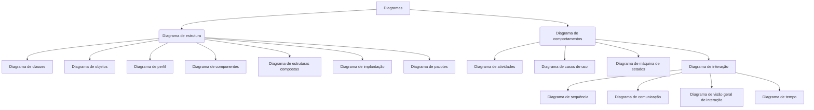

# diagramas_resumo

Uma breve compilação de material (curadoria de conteúdo digital) sobre diversos diagramas utilizados na disciplina de Engenharia de Software.


# Conteúdo:

[1 Definições](#1-Definições) <br>
[2 DER - Diagrama Entidade Relacionamento](#2-DER) <br>
[3 DFD - Diagrama de Fluxo de Dados](#3-DFD) <br>
[4 UML - Unified Modeling Language](#4-UML) <br>
[5 BPMN - Business Process Model and Notation](#5-BPMN) <br>
[Referências](#Referências) <br>


<!---
     comentario 0
     


```
exemplo de caixa de texto
```

-->


---
# 1 Definições

Lorem ipsum dolor sit amet, consectetur adipiscing elit. Quisque auctor ante id ipsum sollicitudin imperdiet vel nec arcu. Maecenas vitae neque non orci lobortis condimentum. Vivamus luctus massa velit, eu mattis tortor porttitor vitae. Quisque posuere nibh nec ornare volutpat. Vivamus id arcu suscipit, convallis odio vel, vehicula nisi. Pellentesque habitant morbi tristique senectus et netus et malesuada fames ac turpis egestas. Nam hendrerit quis diam consectetur pulvinar. Morbi bibendum sagittis sapien, quis efficitur velit iaculis et. Nunc eu arcu et dolor dignissim placerat sed et eros. Vivamus viverra nunc lacus, sit amet porttitor metus tempor et. Proin lectus orci, aliquet et orci nec, rutrum euismod enim. Praesent accumsan nibh quam, eu efficitur mauris convallis dignissim. Lorem ipsum dolor sit amet, consectetur adipiscing elit. Ut blandit, velit vitae lobortis iaculis, mauris urna lacinia ante, quis viverra nisi libero fermentum dolor.


---
# 2 DER

Lorem ipsum dolor sit amet, consectetur adipiscing elit. Quisque auctor ante id ipsum sollicitudin imperdiet vel nec arcu. Maecenas vitae neque non orci lobortis condimentum. Vivamus luctus massa velit, eu mattis tortor porttitor vitae. Quisque posuere nibh nec ornare volutpat. Vivamus id arcu suscipit, convallis odio vel, vehicula nisi. Pellentesque habitant morbi tristique senectus et netus et malesuada fames ac turpis egestas. Nam hendrerit quis diam consectetur pulvinar. Morbi bibendum sagittis sapien, quis efficitur velit iaculis et. Nunc eu arcu et dolor dignissim placerat sed et eros. Vivamus viverra nunc lacus, sit amet porttitor metus tempor et. Proin lectus orci, aliquet et orci nec, rutrum euismod enim. Praesent accumsan nibh quam, eu efficitur mauris convallis dignissim. Lorem ipsum dolor sit amet, consectetur adipiscing elit. Ut blandit, velit vitae lobortis iaculis, mauris urna lacinia ante, quis viverra nisi libero fermentum dolor.

```
Dica: exemplo de caixa de texto
```

---
# 3 DFD

Lorem ipsum dolor sit amet, consectetur adipiscing elit. Quisque auctor ante id ipsum sollicitudin imperdiet vel nec arcu. Maecenas vitae neque non orci lobortis condimentum. Vivamus luctus massa velit, eu mattis tortor porttitor vitae. Quisque posuere nibh nec ornare volutpat. Vivamus id arcu suscipit, convallis odio vel, vehicula nisi. Pellentesque habitant morbi tristique senectus et netus et malesuada fames ac turpis egestas. Nam hendrerit quis diam consectetur pulvinar. Morbi bibendum sagittis sapien, quis efficitur velit iaculis et. Nunc eu arcu et dolor dignissim placerat sed et eros. Vivamus viverra nunc lacus, sit amet porttitor metus tempor et. Proin lectus orci, aliquet et orci nec, rutrum euismod enim. Praesent accumsan nibh quam, eu efficitur mauris convallis dignissim. Lorem ipsum dolor sit amet, consectetur adipiscing elit. Ut blandit, velit vitae lobortis iaculis, mauris urna lacinia ante, quis viverra nisi libero fermentum dolor.

```
Dica: exemplo de caixa de texto
```

---
# 4 UML

Lorem ipsum dolor sit amet, consectetur adipiscing elit. Quisque auctor ante id ipsum sollicitudin imperdiet vel nec arcu. Maecenas vitae neque non orci lobortis condimentum. Vivamus luctus massa velit, eu mattis tortor porttitor vitae. Quisque posuere nibh nec ornare volutpat. Vivamus id arcu suscipit, convallis odio vel, vehicula nisi. Pellentesque habitant morbi tristique senectus et netus et malesuada fames ac turpis egestas. Nam hendrerit quis diam consectetur pulvinar. Morbi bibendum sagittis sapien, quis efficitur velit iaculis et. Nunc eu arcu et dolor dignissim placerat sed et eros. Vivamus viverra nunc lacus, sit amet porttitor metus tempor et. Proin lectus orci, aliquet et orci nec, rutrum euismod enim. Praesent accumsan nibh quam, eu efficitur mauris convallis dignissim. Lorem ipsum dolor sit amet, consectetur adipiscing elit. Ut blandit, velit vitae lobortis iaculis, mauris urna lacinia ante, quis viverra nisi libero fermentum dolor.




@startuml

Instance <|-- VulkanRootObject

class Instance {
    -- Contructors & destructors --
    - Instance()
    
    -- Public methods --
    + Initialize() : bool
}

@enduml


 |
 +-- UML
 |    |
 |    +-- Instance.puml
 |         ...    
 |
 +-- README.md
      ...

```mermaid
  graph TD;
      A-->B;
      A-->C;


Comparativo:

|	          | CPSI          | Contrato de fornecimento|
| ------------ | ------------- | ----------------------- |
| Tempo        | 12 meses + 12 | 24 meses + 24           |
| Valor        | 1,6 milhão    | 8 milhões               |


---
# 5 BPMN

Lorem ipsum dolor sit amet, consectetur adipiscing elit. Quisque auctor ante id ipsum sollicitudin imperdiet vel nec arcu. Maecenas vitae neque non orci lobortis condimentum. Vivamus luctus massa velit, eu mattis tortor porttitor vitae. Quisque posuere nibh nec ornare volutpat. Vivamus id arcu suscipit, convallis odio vel, vehicula nisi. Pellentesque habitant morbi tristique senectus et netus et malesuada fames ac turpis egestas. Nam hendrerit quis diam consectetur pulvinar. Morbi bibendum sagittis sapien, quis efficitur velit iaculis et. Nunc eu arcu et dolor dignissim placerat sed et eros. Vivamus viverra nunc lacus, sit amet porttitor metus tempor et. Proin lectus orci, aliquet et orci nec, rutrum euismod enim. Praesent accumsan nibh quam, eu efficitur mauris convallis dignissim. Lorem ipsum dolor sit amet, consectetur adipiscing elit. Ut blandit, velit vitae lobortis iaculis, mauris urna lacinia ante, quis viverra nisi libero fermentum dolor.

---
# Referências

Lorem ipsum dolor sit amet, consectetur adipiscing elit. Quisque auctor ante id ipsum sollicitudin imperdiet vel nec arcu. Maecenas vitae neque non orci lobortis condimentum. Vivamus luctus massa velit, eu mattis tortor porttitor vitae. Quisque posuere nibh nec ornare volutpat. Vivamus id arcu suscipit, convallis odio vel, vehicula nisi. Pellentesque habitant morbi tristique senectus et netus et malesuada fames ac turpis egestas. Nam hendrerit quis diam consectetur pulvinar. Morbi bibendum sagittis sapien, quis efficitur velit iaculis et. Nunc eu arcu et dolor dignissim placerat sed et eros. Vivamus viverra nunc lacus, sit amet porttitor metus tempor et. Proin lectus orci, aliquet et orci nec, rutrum euismod enim. Praesent accumsan nibh quam, eu efficitur mauris convallis dignissim. Lorem ipsum dolor sit amet, consectetur adipiscing elit. Ut blandit, velit vitae lobortis iaculis, mauris urna lacinia ante, quis viverra nisi libero fermentum dolor.


