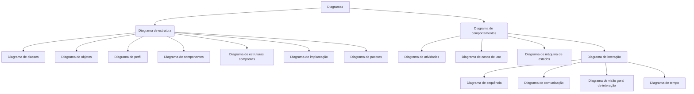

# Breve resumo de diagramas

Uma breve compilação de material (curadoria de conteúdo digital) sobre diversos diagramas utilizados na disciplina de engenharia de software, projeto de software, arquitetura de sistemas e bancos de dados. "Resumo dos diagramas mais comuns" que usamos nestas disciplinas. Este não é um guia definitivo, mas um pequeno tutorial compilado para auxiliar alunos e devs. Este material esta em construção.


# Conteúdo:

[1 Definições](#1-Definições) <br>
[2 DER - Diagrama Entidade Relacionamento](#2-DER) <br>
[3 DFD - Diagrama de Fluxo de Dados](#3-DFD) <br>
[4 UML - Unified Modeling Language](#4-UML) <br>
[5 BPMN - Business Process Model and Notation](#5-BPMN) <br>
[5 Gantt](#6-gantt)<br>
[Referências](#Referências) <br>


<!---


     comentario 0
     


```
exemplo de caixa de texto
```

-->


---
# 1 Definições

Um diagrama é um desenho mostrando um estrutura ou representação esquemática de algo (como uma máquina ou sistema), de forma a apresentar simplificadamente sua estrutura e/ou funcionamento. <br>

Definição 1: Diagrama é uma representação gráfica usada para demonstrar um esquema simplificado ou um resumo sobre um assunto.<br>
 Fonte: https://www.significados.com.br/diagrama/

Definição 2: O diagrama é um gráfico que apresenta informação de forma esquematizada e relacionada a algum tipo de área, seja na política ou economia de algum país ou empresa, e que aparece representada numericamente e em forma de tabela.<br>

Fonte: https://conceitos.com/diagrama/

Definição 3: Delineação; modo de representação feito através de gráficos, de esquemas, de linhas, de pontos: diagrama elétrico. Esboço; demonstração dos aspectos gerais de alguma coisa: diagrama do televisor. Tipo de maquete que contém o cenário usado nas filmagens. <br>

Fonte: https://www.dicio.com.br/diagrama/


---
# 2 DER

É um tipo de diagrama que apresenta as entidades de um sistema; estas entidades são conectadas por relacionamentos, as entidades possuem internamente atributos. Este diagrama é utilizado para modelar bancos de dados, também pode representar regras de negócio utilizadas pelas empresas. Também permite perceber as conexões lógicas entre "as coisas" com as quais se deseja representar informações. O criado deste diagrama é o Professor Peter Chen ([Peter Pin-Shan Chen](https://en.wikipedia.org/wiki/Peter_Chen)) na década de 1970 naSloan School of Management no MIT publicado em “The Entity-Relationship Model: Toward a Unified View of Data". O trabalho de DER contribuiu para o modelo de Classes e posteriormente com a UML. <br>

São componentes de um DER: entidades, atributos e relacionamentos. Os diagramas entidade relacionamento também proporcionam um meio de comunicação. Os diagramas entidades relacionamento são também chamados de diagram ER, Modelo ER. São diagramas estruturais utilizados principalmente para o projeto de um banco de dados (relacional e/ou objeto relacional). <br>


Na figura abaixo temos 3 exemplos, esta figura esta dividida ao meio, prefira as notações da direita.<br>


## 2.1 Entidade


As entidades são "as coisas" que queremos representar e guardar informações sobre. São exemplos de entidades carros, objetos, lugares, pessoas, veículos, etc. As entidades são representadas por um retângulo com seu nome no centro. Na figura abaixo temos várias formas de notação diferentes para representar uma entidade.<br>


## 2.2 Atributos

Os atributos dão características das entidades. São os elementos básicos que ajudam a formar e dar identidade às entidades. São os tijolos básicos das entidades e sua compreensão. Atributos também podem ser características de relações. <br>


```
Observação:
Algumas ferramentas de diagramação os atributos estão conectados nas
entidades e representados em forma oval. É bom citar que esta é uma das
piores formas de representação de atributos em entidades, pois os diagramas
tendem a crescer conforme o analista vai melhorando ou especificando mais
detalhes nos diagramas, essa abordagem de usar  balões como atributos 
flutuando conectados nas suas respectivas entidades não é eficiente.
```

Recomendamos representar os atributos dentro do retângulo das entidades, separando apenas o título da entidade dos atributos por uma linha. Abaixo temos uma representação na figura da esquerda a visão lógica e na da direita a visão física, representam a mesma entidade com duas visões diferentes; este mesmo exemplo pode ser utilizado nas situações de modelagem de  classe (visão lógica e física).<br>


## 2.3 Relacionamentos

A forma como uma entidade se conecta com outra, ou seja, a forma como uma entidade (ou objeto ou "coisa") esta associada com outras deve ser representada por uma ligação. Esta ligação é chamada de relacionamento. Basicamente uma relação pode ser representada por uma linha simples, interligando as entidades. <br>

Nota: As entidades devem ter atributos semelhantes (e com tipos de dados semelhantes) para que esta ligação possa ser realizada. Sugerimos leituras sobre as chaves estrangeiras (FK).<br>

```
Observação:
Existem diversas formas de notação, uma delas é pela utilização
de uma figura tipo um diamante no centro da linha que interliga as
entidades, não recomendamos pois esse tipo de abordagem, mais uma 
vez... acaba ocupando uma quantidade grande de espaço conforme o 
modelo vai sendo especializado e ampliado.
```

Na figura abaixo o relacionamento pode ser lido como: 1(um) aluno "pode ter" zero ou muitos "pets" ou 1 (um) aluno tem nenhum ou mais de um pets. O lado "nenhum" (entidade na direita) pode ser visto como circulo vazio, também nesse lado direito as 3 linhas também podem ser chamadas de "pé de corvo". Pois um aluno pode ter mais de um pets assim como podem haver alunos com nenhum pets.<br>


Na figura abaixo temos vários exemplos de relacionamentos e suas notações com a respectiva cardinalidade (quantidade de ocorrências das entidades em cada lado).<br>


<br>

Que tal desenha o mais informal possível ? Objetivando apenas representar as entidades e suas relações.<br>


---
# 3 DFD


O diagrama de fluxo de dados é uma forma de representação das principais funções de um sistema e movimentação de dados entre estas funções, saíde de entidades e arquivos (ou bancos de dados). O DFD foi desenvolvido e popularizado na década de 70, onde ainda era comum a utilização de arquivos para o armazenamento de dados. Os principais desenvolvedores e promotores deste tipo de diagrama são: Edward Yourdon, Larry Constantine, Tom DeMarco, Chris Gane and Trish Sarson.


Os símbolos utilizados pelo DFD são simples e poucos, sendo eles:<br>

| Símbolo    | Descrição |
| -------- | ------- |
| Círculo  | Processo ou função   |
| Retângulo | Entidade externa     |
| Retângulo com a lateral aberta | Arquivo de dados ou banco de dados |
| Seta | Sentido do fluxo de dados, com descrição de dados |
| Retângulo "maior" pontilhado | Opcional, geralmente representa as fronteiras do sistema |

<br>


---
# 4 UML

UML significa Unified Modeling Language (ou linguagem de modelagem unificada), é um componente da engenharia de software como ferramenta de diagramação e modelagem de sistemas principalmente orientados a objetos. Outros tipos de sistemas como estruturados, real-time também podem ser modelados com UML (apesar de este não ser seu foco principal). A UML é divida em vários diagramas que abordam aspectos dinâmicos e estáricos da visão estrutural de um sistema.  A UML surgiu  na década de 1990 pelo Object Management Group (OMG).


Todos os diagramas da UML são:<br>

A-Diagramas de estrutura (aspecto estático):<br>
* 1-Diagrama de classes<br>
* 2-Diagrama de objetos<br>
* 3-Diagrama de perfil<br>
* 4-Diagrama de componentes<br>
* 5-Diagrama de estruturas compostas<br>
* 6-Diagrama de implantação<br>
* 7-Diagrama de pacotes<br>

B-Diagramas de comportamentos (aspecto dinâmico):<br>
* 8-Diagrama de atividades<br>
* 9-Diagrama de casos de uso<br>
* 10-Diagrama de máquina de estados<br>
* 11-Diagrama de sequência<br>
* 12-Diagrama de comunicação<br>
* 13-Diagrama de visão geral de interação<br>
* 14-Diagrama de tempo<br>


Tipos de diagramas da UML:




Acreditamos que os mais interessantes e populares são os citados a seguir:

## 4.1 Diagrama de classes

O diagrama de classe são o pilar da UML e dos projetos OO. A classe é um retângulo dividido em 3 partes (nome da classe, atributos(características ou campos) e métodos (procedimentos ou funções)). O diagrama de classes e subclasses são associadas via uma relação (similar ao DER (diagrama entidade relacionemnto)) permitindo apresentar os componentes estáticos de um sistema, esquematizando estruturas de dados poderão ser implementadas na forma de tabelas em um banco e como funções de aplicações.

Exemplos:


Note que na figura temos uma associação (ou relação) do tipo generalização (e especialização), representada por um triangulo no início da linha. O conceito de hereditariedade é também representado por este símbolo uma linha com uma seta:


Alguns símbolos de acesso mais populares (ou modificadores de acesso ou visibilidade):

| Símbolo    | Significado |
| -------- | ------- |
| +  | Público    |
| - | Privado    |
| #    | Protegido    |

Definição: "**Public**: qualquer um pode acessar variáveis de instância públicas. **Protected**: apenas métodos do mesmo pacote ou subclasse podem acessar variáveis de instância protegidas. **Private**: apenas métodos da mesma classe (excluindo métodos de uma subclasse) podem acessar variáveis de instâncias privadas” (Fonte: https://blog.grancursosonline.com.br/java-modificadores-de-acesso-parte-ii-15-questoes-comentadas/#:~:text=public%3A%20qualquer%20um%20pode%20acessar,acessar%20vari%C3%A1veis%20de%20inst%C3%A2ncias%20privadas%E2%80%9D.)

Como exemplificado na figura abaixo:<br>


## 4.2. Diagrama de casos de uso

## 4.3. Diagrama de componentes

O diagrama de componenes é um "desenho" importante no projeto de um software pois apresenta os "órgãos" (ou estruturas) internas do software. Este diagrama apresenta a forma como estão conectados os elementos do software. Um componente pode representar um agrupamento de classes ou uma classe entre sistemas ou subsistemas desde que estes tenham alguma interação entre si. São identificadores apenas componentes necessários para que o sistema funcione. 

Permite representar partes de códigos fontes, pois permite representar as partes funcionais de interesse. Permite representar as peças distribuíveis e/ou substituíveis de um sistema, bem como os pontos de interface do sistema que se deseja representar e seu contato com outros sistemas. É possível representar e agrupar cada função do sistema.

Os elementos representados podem ser vários como:
* biblitecas de funções (ou outros tipos de bibliotecas)
* arquivos de documentação
* executáveis
* arquivos ou tabelas
* formulários (ou telas de usuários)
* relatórios (projeto ou templates de relatórios)
* entre outros elementos que se deseja representar


```
Nota: A UML usa o termo componente para indicar um módulo
 (de classes) que representa um sistema (ou suas sub partes).
```

O diagrama de componentes pode ser representado de várias formas, seguem alguns exemplos:

## 4.4. Diagrama de implantação

## 4.5. Diagrama de pacotes

## 4.6. Diagrama de atividades

## 4.7. Diagrama de sequência


---
## Fundamental Modeling Concepts (FMC)

http://www.fmc-modeling.org/home


```
Dica: simplesmente não recomendo FMC no momento !
Prezados alunos... fiquem longe disso !
```


---
# 5 BPMN

Página em construção...


---
# 6 Gantt


Página em construção...


---
# Referências recomendadas


---
## Comentários finais 


```
Critérios para os diagramas entrar nesta lista:
1. São materiais de suporte ao projeto e desenvolvimento de sistemas e bancos de dados.
2. Material foi ou poderá ser usado em sala de aula.
```


---
# Avisos, licença, observações, estatísticas


```
As informações aqui contidas podem ser alteradas sem aviso prévio.
Primeira postagem em: 17/jun/2023. 
Última atualização em: 06/agosto/2023.
Se desejar conhecer outras ferramentas para desenvolvimento de software, consulte a página: https://github.com/monteiro74/lista_de_ferramentas#5-IDEs
```
Lista de ferramentas: https://github.com/monteiro74/lista_de_ferramentas#5-IDEs


```
Autor: Prof. Dr. Monteiro.
Licença: Attribution-NonCommercial-ShareAlike 4.0 International (CC BY-NC-SA 4.0) 
https://creativecommons.org/licenses/by-nc-sa/4.0/

```

Histórico de atualizações nos repositórios do Prof. Monteiro:<br>
[](https://github.com/monteiro74/diagramas_resumo)


[](https://git.io/streak-stats)


[](https://github.com/monteiro74/github-readme-stats)


Pulse:<br>
https://github.com/monteiro74/diagramas_resumo/pulse<BR>

Contribuições de:<br>
<a href="https://github.com/monteiro74/diagramas_resumo/contributors">
  
</a>

Histórico de frequência de código:<BR>
https://github.com/monteiro74/diagramas_resumo/graphs/code-frequency<BR>

Atividade de commits:<BR>
https://github.com/monteiro74/diagramas_resumo/graphs/commit-activity<BR>

Trafego:<BR>
https://github.com/monteiro74/diagramas_resumo/graphs/traffic<BR>

[Voltar ao sumário](#conteúdo)<br>

