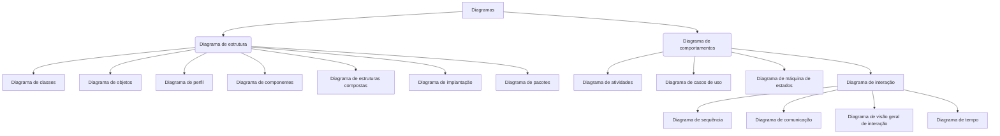

# diagramas_resumo

Uma breve compilação de material (curadoria de conteúdo digital) sobre diversos diagramas utilizados na disciplina de engenharia de software, projeto de software, arquitetura de sistemas e bancos de dados. "Resumo dos diagramas mais comuns" que usamos nestas disciplinas. Este não é um guia definitivo, mas um pequeno tutorial compilado para auxiliar alunos e devs.


# Conteúdo:

[1 Definições](#1-Definições) <br>
[2 DER - Diagrama Entidade Relacionamento](#2-DER) <br>
[3 DFD - Diagrama de Fluxo de Dados](#3-DFD) <br>
[4 UML - Unified Modeling Language](#4-UML) <br>
[5 BPMN - Business Process Model and Notation](#5-BPMN) <br>
[Referências](#Referências) <br>


<!---


     comentario 0
     


```
exemplo de caixa de texto
```

-->


---
# 1 Definições

Um diagrama é um desenho mostrando um estrutura ou representação esquemática de algo (como uma máquina ou sistema), de forma a apresentar simplificadamente sua estrutura e/ou funcionamento.


---
# 2 DER

Lorem ipsum dolor sit amet, consectetur adipiscing elit. Quisque auctor ante id ipsum sollicitudin imperdiet vel nec arcu. 

## 2.1 Entidade

Lorem ipsum dolor sit amet, consectetur adipiscing elit. Quisque auctor ante id ipsum sollicitudin imperdiet vel nec arcu. 

## 2.2 Atributos

Lorem ipsum dolor sit amet, consectetur adipiscing elit. Quisque auctor ante id ipsum sollicitudin imperdiet vel nec arcu. 

## 2.3 Relacionamentos

Lorem ipsum dolor sit amet, consectetur adipiscing elit. Quisque auctor ante id ipsum sollicitudin imperdiet vel nec arcu. 


```
Dica: exemplo de caixa de texto
```

---
# 3 DFD

Lorem ipsum dolor sit amet, consectetur adipiscing elit. Quisque auctor ante id ipsum sollicitudin imperdiet vel nec arcu. Maecenas vitae neque non orci lobortis condimentum. Vivamus luctus massa velit, eu mattis tortor porttitor vitae. Quisque posuere nibh nec ornare volutpat. Vivamus id arcu suscipit, convallis odio vel, vehicula nisi. Pellentesque habitant morbi tristique senectus et netus et malesuada fames ac turpis egestas. Nam hendrerit quis diam consectetur pulvinar. Morbi bibendum sagittis sapien, quis efficitur velit iaculis et. Nunc eu arcu et dolor dignissim placerat sed et eros. Vivamus viverra nunc lacus, sit amet porttitor metus tempor et. Proin lectus orci, aliquet et orci nec, rutrum euismod enim. Praesent accumsan nibh quam, eu efficitur mauris convallis dignissim. Lorem ipsum dolor sit amet, consectetur adipiscing elit. Ut blandit, velit vitae lobortis iaculis, mauris urna lacinia ante, quis viverra nisi libero fermentum dolor.

Comparativo:

|	          | CPSI          | Contrato de fornecimento|
| ------------ | ------------- | ----------------------- |
| Tempo        | 12 meses + 12 | 24 meses + 24           |
| Valor        | 1,6           | 8                       |

```
Dica: exemplo de caixa de texto
```

---
# 4 UML

Lorem ipsum dolor sit amet, consectetur adipiscing elit. Quisque auctor ante id ipsum sollicitudin imperdiet vel nec arcu. Maecenas vitae neque non orci lobortis condimentum. Vivamus luctus massa velit, eu mattis tortor porttitor vitae. Quisque posuere nibh nec ornare volutpat. Vivamus id arcu suscipit, convallis odio vel, vehicula nisi. Pellentesque habitant morbi tristique senectus et netus et malesuada fames ac turpis egestas. Nam hendrerit quis diam consectetur pulvinar. Morbi bibendum sagittis sapien, quis efficitur velit iaculis et. Nunc eu arcu et dolor dignissim placerat sed et eros. Vivamus viverra nunc lacus, sit amet porttitor metus tempor et. Proin lectus orci, aliquet et orci nec, rutrum euismod enim. Praesent accumsan nibh quam, eu efficitur mauris convallis dignissim. Lorem ipsum dolor sit amet, consectetur adipiscing elit. Ut blandit, velit vitae lobortis iaculis, mauris urna lacinia ante, quis viverra nisi libero fermentum dolor.


Todos os diagramas da UML:<br>

A-Diagrama de estrutura:<br>
* 1-Diagrama de classes<br>
* 2-Diagrama de objetos<br>
* 3-Diagrama de perfil<br>
* 4-Diagrama de componentes<br>
* 5-Diagrama de estruturas compostas<br>
* 6-Diagrama de implantação<br>
* 7-Diagrama de pacotes<br>

B-Diagrama de comportamentos:<br>
* 8-Diagrama de atividades<br>
* 9-Diagrama de casos de uso<br>
* 10-Diagrama de máquina de estados<br>
* 11-Diagrama de sequência<br>
* 12-Diagrama de comunicação<br>
* 13-Diagrama de visão geral de interação<br>
* 14-Diagrama de tempo<br>


Tipos de diagramas da UML:




### 4.1 Diagrama de classes

Definição

Exemplos:


## Fundamental Modeling Concpets (FMC)

http://www.fmc-modeling.org/home


---
# 5 BPMN

Lorem ipsum dolor sit amet, consectetur adipiscing elit. Quisque auctor ante id ipsum sollicitudin imperdiet vel nec arcu. Maecenas vitae neque non orci lobortis condimentum. Vivamus luctus massa velit, eu mattis tortor porttitor vitae. Quisque posuere nibh nec ornare volutpat. Vivamus id arcu suscipit, convallis odio vel, vehicula nisi. Pellentesque habitant morbi tristique senectus et netus et malesuada fames ac turpis egestas. Nam hendrerit quis diam consectetur pulvinar. Morbi bibendum sagittis sapien, quis efficitur velit iaculis et. Nunc eu arcu et dolor dignissim placerat sed et eros. Vivamus viverra nunc lacus, sit amet porttitor metus tempor et. Proin lectus orci, aliquet et orci nec, rutrum euismod enim. Praesent accumsan nibh quam, eu efficitur mauris convallis dignissim. Lorem ipsum dolor sit amet, consectetur adipiscing elit. Ut blandit, velit vitae lobortis iaculis, mauris urna lacinia ante, quis viverra nisi libero fermentum dolor.


Comparativo:

|	          | CPSI          | Contrato de fornecimento|
| ------------ | ------------- | ----------------------- |
| Tempo        | 12 meses + 12 | 24 meses + 24           |
| Valor        | 1,6           | 8                       |

---
# Referências

Lorem ipsum dolor sit amet, consectetur adipiscing elit. Quisque auctor ante id ipsum sollicitudin imperdiet vel nec arcu. Maecenas vitae neque non orci lobortis condimentum. Vivamus luctus massa velit, eu mattis tortor porttitor vitae. Quisque posuere nibh nec ornare volutpat. Vivamus id arcu suscipit, convallis odio vel, vehicula nisi. Pellentesque habitant morbi tristique senectus et netus et malesuada fames ac turpis egestas. Nam hendrerit quis diam consectetur pulvinar. Morbi bibendum sagittis sapien, quis efficitur velit iaculis et. Nunc eu arcu et dolor dignissim placerat sed et eros. Vivamus viverra nunc lacus, sit amet porttitor metus tempor et. Proin lectus orci, aliquet et orci nec, rutrum euismod enim. Praesent accumsan nibh quam, eu efficitur mauris convallis dignissim. Lorem ipsum dolor sit amet, consectetur adipiscing elit. Ut blandit, velit vitae lobortis iaculis, mauris urna lacinia ante, quis viverra nisi libero fermentum dolor.


